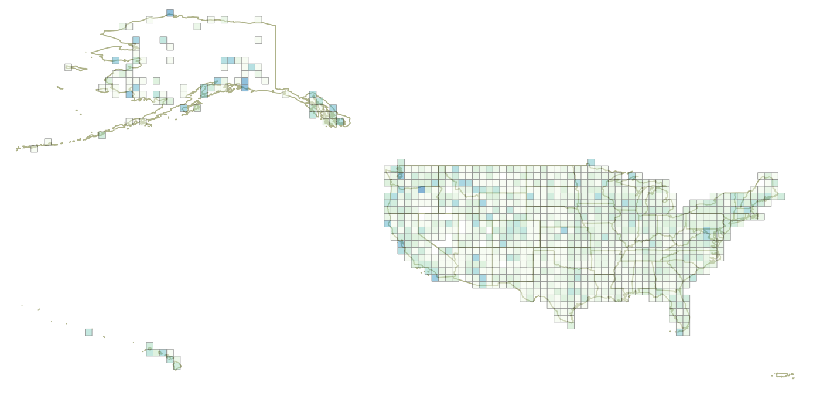

# Which US locations watch the most TED Talks per capita?

Basic data sources are:

  - TED view data broken down by location. Locations are based on IP addresses,
    using MaxMind's [GeoLiteCity](http://dev.maxmind.com/geoip/geoip2/geolite2/) product.
  - Populations are measured at county level, using US Census Bureau data.
    - 2010 county boundaries are used.
    - Populations are assigned using 2014 estimates.



## Usage

This assumes you are using OSX. Should work on any OS which can run postgis
and ruby. You'll just need to replace the `brew install` step with something
appropriate for your system.

```
$ brew install postgres
# now start the postgres server

$ cd views_per_capita
$ bundle
$ rake --trace
```

Once this completes, you'll have database tables populated with mappable data.
If you have [QGIS](http://qgis.org/en/site/) installed, you can open the
`views_per_capita.qgs` project file to view some sample layers.

## Methods

I chose to base analysis on equally-sized squares of territory. US counties vary
widely in size and population. I believe that mapping them directly has two
main problems.

  1. When viewing the entire country, small counties are hard to see even if
     they have significant population or views per capita.
  1. Geocoding an IP address to a latiude & longitude is an inexact process.
     Mapping individual counties gives an unwarranted impression of accuracy.
     Creating arbitrary evenly-sized units avoids this problem somewhat.

I used the following algorithm to assign a population to each of the generated
grid cells:

For each grid cell:

  1. Find all counties which intersect the cell.
  1. Determine the percentage of each county's area which is intersected by the cell.
  1. Assign that percentage of each county's population to the cell.

This assumes that population is evenly distributed across each county, which is
certainly not true. Counties are the most granular units for which the Census Bureau
provides a single data set which covers the entire country. They also provide
shapefiles of census tracts, but these must be downloaded per-state. For this
initial exploration, counties felt like an acceptable level of granularity.
